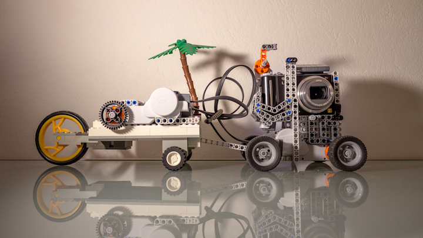
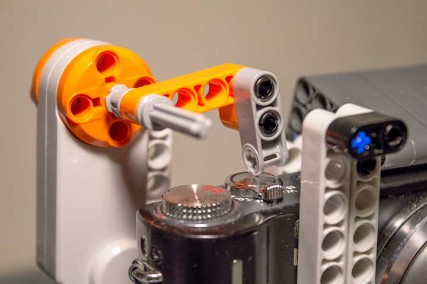
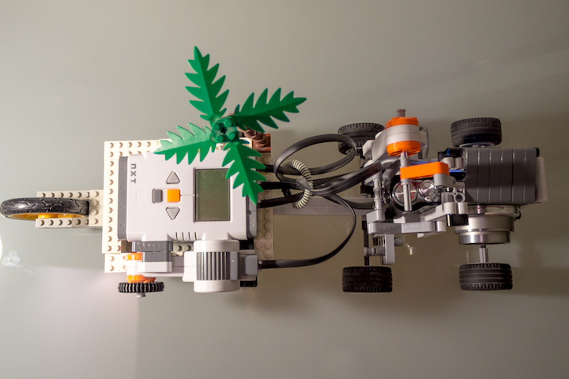
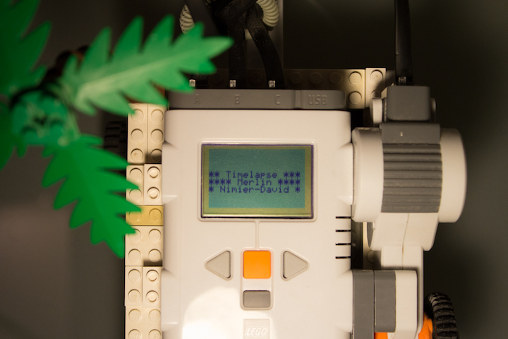
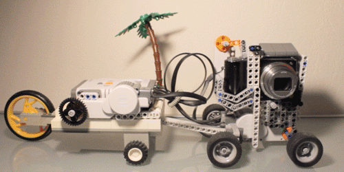

NXTimelapse
===========
Teach your robot how to shoot a timelapse!

_Note_: This code was written a long time ago and it was one of my first Java projects. Please excuse the inevitable quircks, and the comments in French.

# Project origin
A few years back, I wanted to shoot timelapses. But I only had a small point-and-shoot camera, with no manual mode nor any way to shoot pictures at a specific interval of time. I didn't want to press the shutter button for hours on end myself... so I built a robot to do it for me.

# Requirements
- Lego Mindstorm NXT (and newer versions, probably)
- Running the [LeJOS firmware](http://www.lejos.org/) 

# How does it work?

The robot has three main components:
- A "finger" which presses the shutter button
- A space fit for the camera
- Wheels, and a cart to house the NXT brick which contains the software

## Still mode
The most common use is to shoot a still timelapse: the robot will take care of pressing the shutter button as often and for as long as you ask it to.
As a cool bonus, I fitted a servo-motor on the side of the brick. With a bit of code, I was able to make it into a selection wheel. Inputing large numbers becomes much easier!

## Pan (+ rotate) mode
NXTimelapse gives the option to add a panning effect to your timelapse. You can specify the distance that you want the robot to travel during the timelapse. It will then move slowly between each frame.
